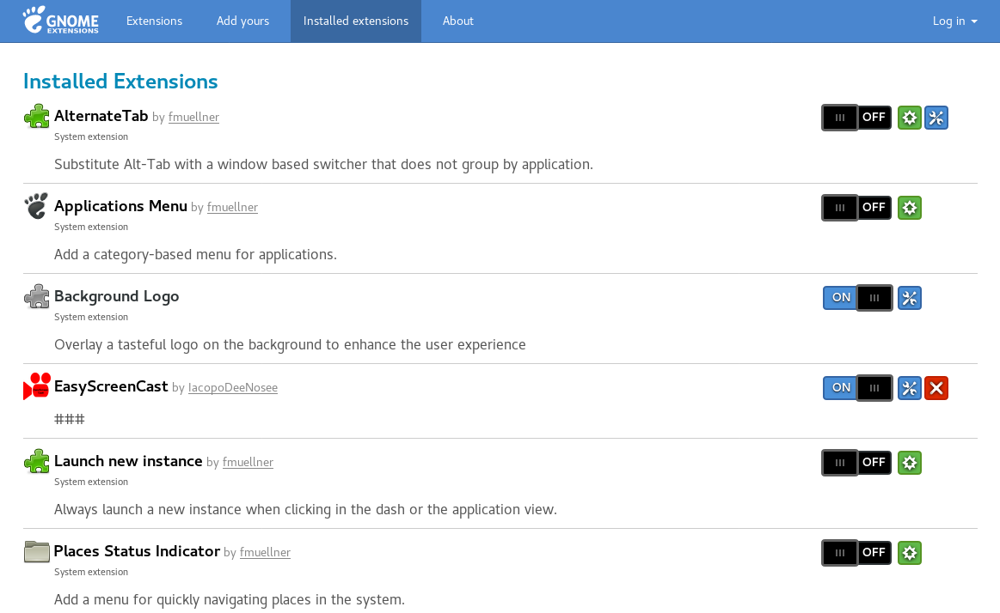
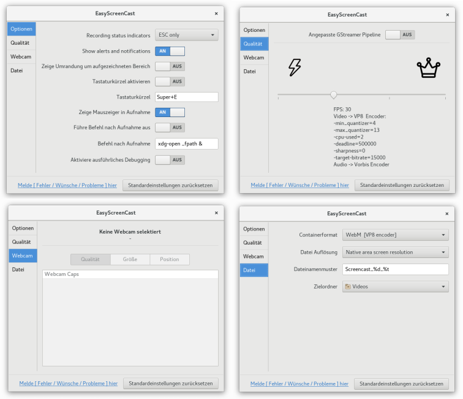

### EasyScreenCast {#easyscreencast}

    
***Abbildung:*** EasyScreenCast

[EasyScreenCast](https://extensions.gnome.org/extension/690/easyscreencast/) ist eine Gnome Shell-Erweiterung.
Ebenso wie der [Gnome Shell Recorder](gnome_shell_recorder.md),
benutzt EasyScreenCast die integrierte Screencast-Funktion von Gnome.
Aber im Vergleich zum Gnome Shell Recorder besitzt EasyScreenCast einen erheblich ausgedehnten Handlungsspielraum.
Das Multimedia-Framework [gstreamer](https://de.wikipedia.org/wiki/GStreamer)
verwaltet die Aufnahmen von EasyScreenCast und dem Gnome Shell Recorder.

#### Installation {#easyscreencast_installation}

Möchten Sie den Funktionsrahmen von Gnome durch eine Gnome Shell-Erweiterung aufstocken,
werden Sie vermutlich auf der Webseite https://extensions.gnome.org/ fündig.
Durch die Erweiterung [GNOME Shell-Integration](https://addons.mozilla.org/de/firefox/addon/gnome-shell-integration/)
für den Webbrowser Firefox können die Gnome Shell-Erweiterungen direkt
auf der [Webseite für Extensions](https://extensions.gnome.org/) gemanagt werden.
Damit die Browser-Erweiterung funktioniert, muss außerdem noch
der [Native Host-Connector](https://wiki.gnome.org/Projects/GnomeShellIntegrationForChrome/Installation) installiert werden.
Bei Fedora wird dazu das Copr region51/chrome-gnome-shell aktiviert und daraus das Paket chrome-gnome-shell installiert.

```
su -c "dnf copr enable region51/chrome-gnome-shell"
su -c "dnf install chrome-gnome-shell"
```

Unter Ubuntu und Linux Mint ist das Paket
für den [Native Host-Connector](https://wiki.gnome.org/Projects/GnomeShellIntegrationForChrome/Installation)
in den Universe Repositories vorhanden und kann mittels `sudo apt-get install chrome-gnome-shell` installiert werden.

    
***Abbildung:*** EasyScreenCast - Webseite

Daraufhin können Sie die Gnome Shell-Erweiterung [EasyScreenCast](https://extensions.gnome.org/extension/690/easyscreencast/)
auf der Webseite https://extensions.gnome.org/ auswählen. 
Bewertungen, Kommentare, eine kurze Beschreibung und ein
Link zu dem [git-Repository](https://github.com/EasyScreenCast/EasyScreenCast) des Projektes befinden sich
auf der Detailseite von EasyScreenCast.
Für die Inbetriebnahme der funktionsreichen Screencast-Erweiterung müssen Sie auf den Kippschalter (On/Off) klicken
und anschließend die Frage: "EasyScreenCast" von extensions.gnome.org herunterladen und installieren ? mit Installieren
beantworten.

    
***Abbildung:*** EasyScreenCast - Installation

Das Verzeichnis von EasyScreenCast, mit allen dazugehörigen Dateien, befindet sich nach der Installation
im lokalen Ordner für die Gnome Shell-Erweiterungen. Der Ordner für die Extensions ist im Home-Verzeichnis
und heißt `~/.local/share/gnome-shell/extensions/`. 
Alle Erweiterungen der Gnome Shell können auf der Seite https://extensions.gnome.org/ unter
["Installed extensions"](https://extensions.gnome.org/local/)
aktiviert, deaktiviert, aktualisiert, konfiguriert und gelöscht werden. 

    
***Abbildung:*** EasyScreenCast - Installed Extensions

Die Erweiterungen können ebenso mit
dem [Gnome-Optimierungswerkzeug gnome-tweak-tool](https://wiki.ubuntuusers.de/GNOME_Tweak_Tool/) verwaltet werden.
Sofern das Optimierungswerkzeug nicht zum Standard Ihrer Linux-Distribution gehört, kann das Paket
mit dem Paketmanager des Betriebssystems nachinstalliert werden. Unter Fedora wird die Installation
mit dem dnf-Kommando `su -c "dnf install gnome-tweak-tool"` durchgeführt. Bei Ubuntu oder Linux Mint
ist der Befehl `sudo apt-get install gnome-tweak-tool` denkbar.
Das Gnome-Optimierungswerkzeug wird mit dem Kommando `gnome-tweak-tool` aufgerufen,
kann aber auch bei den Hilfsprogrammen durch einen Klick auf das Programm-Icon gestartet werden.
In der Rubrik Erweiterungen können die Gnome Shell-Erweiterungen
installiert, aktiviert, deaktiviert, konfiguriert und entfernt werden. 

    
***Abbildung:*** Gnome Tweak Tool - Erweiterungen

Eine andere Variante für die Installation 
ist auf der [github-Seite](https://github.com/EasyScreenCast/EasyScreenCast) von EasyScreenCast einsehbar.
Dieser Installationsweg ist natürlich auch für alle anderen Gnome Shell-Erweiterungen machbar.
Das git-Repository des Projektes wird geklont und anschließend
ins Verzeichnis ~/.local/share/gnome-shell/extensions/ verschoben. 
Für EasyScreenCast wären das folgende Schritte:

```
git clone https://github.com/EasyScreenCast/EasyScreenCast
mv EasyScreenCast ~/.local/share/gnome-shell/extensions/EasyScreenCast@iacopodeenosee.gmail.com
```

#### Einstellungen {#easyscreencast_einstellungen}

Um zu den Einstellungen zu gelangen, existieren verschiedene Pfade:
Der schnellste Weg ist, wenn Sie auf das EasyScreenCast-Icon
in der Taskleiste klicken und daraufhin auf `Optionen` (siehe Abbildung: EasyScreenCast).
Im gnome-tweak-tool, in der Rubrik Erweiterungen, können Sie das Zahnrad von EasyScreenCast,
das die Einstellungen symbolisiert, verwenden. Der blaue, quadratische Button mit den Werkzeugen
(rechts neben dem Kippschalter On/Off) ist der Zugang
zu den Einstellungen über die Seite https://extensions.gnome.org/local/.

    
***Abbildung:*** EasyScreenCast - Einstellungen

Es gibt die vier Einstellungsabschnitte Optionen, Qualität, Webcam und Datei.
Alle haben eigentlich ziemlich selbsterklärende Elemente.
Sobald ein Einstellungspunkt verändert wurde, wird dieser auch im dconf-editor sichtbar.
Das [Dconf](https://en.wikipedia.org/wiki/Dconf)-Schema von EasyScreenCast
trägt die Bezeichnung `org.gnome.shell.extensions.EasyScreenCast`.
Die Schlüssel können mit dem grafischen Tool
[dconf-editor](gnome_shell_recorder.md#gnome_shell_recorder_einstellungen_dconf-editor)
und dem Kommando dconf modifiziert werden.

    
***Abbildung:*** EasyScreenCast - dconf-editor

<style>
    .anmerkung { background: #FFEFD5; padding: 5px;}
</style>

<p class="anmerkung">
<b>Anmerkung:</b><br /><br />

Weil das Schema ein nicht ortsgebundenes Schema ist und sich nicht im Ordner <b>/usr/share/glib-2.0/schemas/</b> befindet, bezieht gsettings dieses Schema nicht mit ein, und die Schlüssel können nicht gelesen oder verändert werden. Das Dconf-Schema von EasyScreenCast wird im lokalen Ordner <b>~/.local/share/gnome-shell/extensions/EasyScreenCast@iacopodeenosee.gmail.com/schemas/</b> aufbewahrt.
</p> 

Dconf ist ein einfaches Kommandozeilenprogramm
für das [Dconf-Konfigurationssystem](https://wiki.ubuntuusers.de/GNOME_Konfiguration/dconf/) von Gnome.
Die Verfahrensweise ist ungleich der von gsettings. Statt durch Punkte, werden die einzelnen Punkte
eines Schemas durch einen Schrägstrich (Slash - /) getrennt, wie in einem Dateisystem. 
An Stelle von get und set bestehen die Kommandos read und write.
Mit dem Befehl `dconf list /org/gnome/shell/extensions/EasyScreenCast/` 
werden alle Schlüssel von EasyScreenCast aufgelistet.
Der Wert eines Schlüssels kann durch die Anweisung `dconf read /org/gnome/shell/extensions/EasyScreenCast/<Schlüssel>`
ausgelesen werden. Die Eingabe `dconf write /org/gnome/shell/extensions/EasyScreenCast/<Schlüssel> <Wert>`
ändert den Inhalt eines Schlüssels ab. 

    
***Abbildung:*** EasyScreenCast - dconf - Beispiel: Schlüssel fps


#### Anwendung {#easyscreencast_anwendung}
