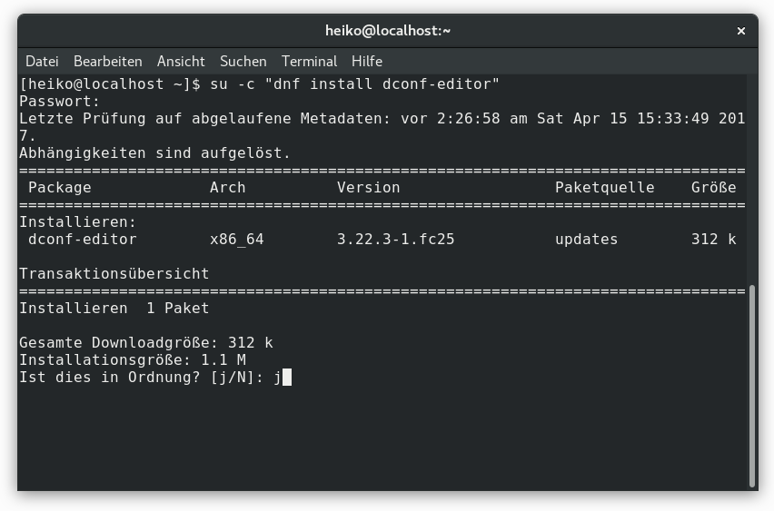
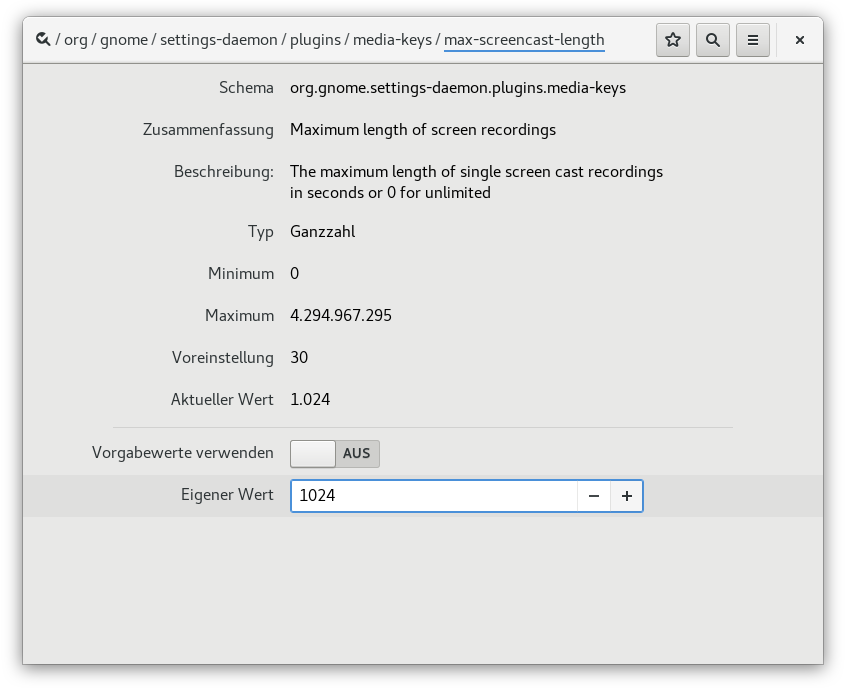
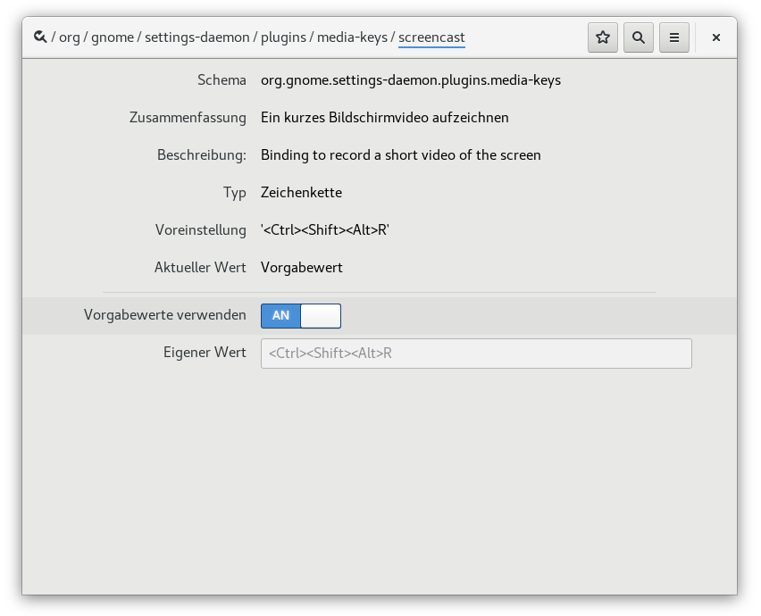

## Gnome Shell Recorder

Seit jeher gehört die Screenshot-Funktionalität (Bildschirmfotos erstellen) zur Grundausstattung von Gnome.
Mit Gnome3 hielt ein weiteres Feature, die Screencast-Funktion (Bildschirmvideoaufnahme),
Einzug in die Ausstattungspalette der grafischen Benutzeroberfläche. 
Der Gnome Shell Recorder streicht somit die Notwendigkeit ein zusätzliches Screencast-Tool zu installieren,
um Bildschirmaktivitäten in einem Video festzuhalten. Leider gilt dies nicht für alle Situationen,
denn der Gnome Shell Recorder nimmt nur den ganzen Bildschirm auf, und das ohne Ton.
Möchten Sie ohne Nachbearbeitung lediglich einen Teil des Bildschirms mit Audio aufzeichnen, 
ist die Installation einer Anwendung, die über ein weitgefächertes Spektrum an Leistungsmerkmalen verfügt, unumgänglich. 

### Anwendung

Mittels Tastenkombination `Strg+Alt+Shift+R` können Sie die Bildschirmaufnahme starten und beenden.
Die Aufnahme wird durch einen kleinen roten Kreis, rechts in der Taskleiste, signalisiert.

    
***Abbildung:*** Gnome Shell Recorder - Aufnahme

Die festgehaltenen Bilder werden in eine .webm-Datei geschrieben. 
Die Datei mit dem Muster "Bildschirmvideo von [Datum] [Uhrzeit].webm"
(Beispiel: "Bildschirmvideo von 15.04.2017 16:03:30.webm") befindet sich im Home-Verzeichnis,
im Unterordner Videos, und enthält den VP9-Videocodec. 
Die Framerate beträgt den Wert 30, was bedeutet, dass 30 Bilder pro Sekunde gespeichert werden.

### Einstellungen

Nach 30 Sekunden wird die Aufnahme automatisch beendet, denn jenes ist die Standard-Einstellung
für die maximale Screencast-Länge. Diese Einstellung und die Tastenkombination für den Start der Aufnahme
können geändert werden. Hier kommt das Einstellungstool dconf-editor ins Spiel. 
Dconf-editor gehört nicht zum Standard und muss nachinstalliert werden.
Bei der Linuxdistribution Fedora leitet man dies mit dem Befehl `su -c "dnf install dconf-editor"`
oder dem Paketmanager seiner Wahl in die Wege.

    
***Abbildung:*** dconf-editor - Installation - Fedora

Der Editor für das dconf-Konfigurationssystem von Gnome3, welches das GConf-System ersetzt hat, 
ist in der Programmauswahl unter Verschiedenes angesiedelt und kann dort gestartet werden.
Ebenso kann die Einstellungsapp per Befehl `dconf-editor` in einem Terminal aufgerufen werden.
Hinter dem Schema `org.gnome.settings-daemon.plugins.media-keys` mit dem Schlüssel `max-screencast-length` verbirgt sich
die Einstellung für die maximale Dauer der Screencast-Aufnahme, mit der Voreinstellung 30. 
Hier können Sie nun einen eigenen Wert bestimmen.

    
***Abbildung:*** dconf-editor - maximale Screencast-Länge

Die Tastenkombination `Strg+Alt+Shift+R` für den Gnome Shell Recorder ist unter 
`org.gnome.settings-daemon.plugins.media-keys screencast` zugänglich.
Wenn Sie eine neue Tastenkomination einstellen möchten, bitte vergessen Sie nicht vorher gründlich zu recherchieren,
ob Ihre Wahl schon irgendwo im Einsatz ist.

    
***Abbildung:*** dconf-editor - Screencast-Tastenkombination

Möchte Sie die Modifikation per Kommando bewerkstelligen, so sei an dieser Stelle der Befehl gsettings erwähnt.
Folgende Eingaben sind denkbar um die gesetzten Werte abzurufen.

```
# gsettings get SCHEMA SCHLÜSSEL
#
# den Wert für die maximale Screencast-Länge abfragen
gsettings get org.gnome.settings-daemon.plugins.media-keys max-screencast-length
# Ausgabe: uint32 30
#
# die Tastenkombination für den Gnome Shell Recorder einsehen
gsettings get org.gnome.settings-daemon.plugins.media-keys screencast
# Ausgabe: '<Ctrl><Shift><Alt>R'
```

Im Gegensatz zu get, das die Werte einzelner Schlüssel ausliest, können mit set die Werte abgeändert werden.

```
# gsettings set SCHEMA SCHLÜSSEL WERT
#
# den Wert für die maximale Screencast-Länge ändern
gsettings set org.gnome.settings-daemon.plugins.media-keys max-screencast-length 1024
# neue maximale Screencast-Länge: 1024 Sekunden
#
# die Tastenkombination für den Gnome Shell Recorder ändern
gsettings set org.gnome.settings-daemon.plugins.media-keys screencast '<Ctrl><Shift><Alt>R'
```
