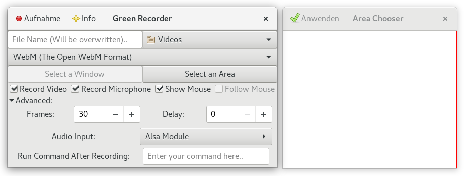
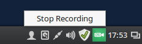
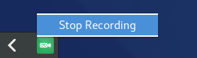

### Green Recorder

    
***Abbildung:*** Green Recorder mit Area Chooser

Wer versucht mit dem [SimpleScreenRecorder](simplescreenrecorder.md) oder mit 
[recordMyDesktop](recordmydesktop.md) unter [Wayland](https://wayland.freedesktop.org/) Screencasts aufzunehmen, 
der wird womöglich sein schwarzes Wunder erleben,
denn in den Aufnahmen ist nichts weiter als ein schwarzer Bildschirm zu sehen.

Der Green Recorder ist ein weiteres Tool im großen Screencasting-Repertoire, aber eines der wenigen in der Sammlung
Screencasting unter Wayland. Was unter Wayland funtioniert ist der 
hauseigene [Shell Recorder](gnome_shell_recorder.md) von Gnome, der mit der
Tastenkombination Strg+Alt+Shift+R aktiviert und deaktiviert werden kann. 
Zur Erinnerung, die Länge der Aufnahme ist eventuell standardmäßig auf 30 Sekunden begrenzt,
kann aber mit dem [dconf-editor](gnome_shell_recorder.md#gnome_shell_recorder_einstellungen) nach oben geschraubt werden.

Der Green Recorder funktioniert ebenfalls unter Wayland 
und ist bei [github](https://github.com/green-project/green-recorder) zu finden. 
Die Installationshinweise für [Ubuntu](https://de.wikipedia.org/wiki/Ubuntu),
[Linux Mint](https://de.wikipedia.org/wiki/Linux_Mint), Fedora
und [Arch Linux](https://de.wikipedia.org/wiki/Arch_Linux) stehen
im [git](https://de.wikipedia.org/wiki/Git)-Repository zur Verfügung.

#### Installation

Unter Ubuntu und Linux Mint fügen Sie zuerst das dazugehörige PPA für den Green Recorder hinzu.
Nach dem Update können Sie den Green Recorder installieren. Folgende Kommandos werden für die Installation benötigt:

```
sudo add-apt-repository ppa:mhsabbagh/greenproject
sudo apt-get update
sudo apt-get install green-recorder
```

#### Anwendung

Der Green Recorder ist fortan Teil der Multimedia-Sektion im Menü. 
Das Programm kann über das Menü oder mittels Kommando `green-recorder` gestartet werden. 
Unmittelbar nach dem Start wird eine kleine, einfache Oberfläche präsentiert.
Wo, in welchem Format und was aufgenommen wird kann ohne Umwege eingestellt werden.
Den Startschuss für die Aufnahme können Sie über den Button Aufnahme/Record, oben links im Fenster, geben.

    
***Abbildung:*** Green Recorder - Aufnahme stoppen (Linux Mint - Cinnamon)

Ein roter Kreis signalisiert, dass die Aufnahme läuft.
Beendet ist die Aufnahme wenn Sie auf das Icon des Green Recorders klicken und anschließend auf "Stop Recording".
Bei Linux Mint (Desktop: Cinnamon) befindet sich das Icon rechts in der Taskleiste.
Unter Fedora (Gnome) wird das Icon unten links im Bildschirm eingebunden.

    
***Abbildung:*** Green Recorder - Aufnahme stoppen (Linux Mint - Cinnamon)

    
***Abbildung:*** Green Recorder - Aufnahme stoppen (Fedora - Gnome)

Sofern an den Einstellungen nichts verändert wurde, landet das aufgenommene Video im Verzeichnis `~/Videos/`.
Der Dateiname (Beispiel: `2017-04-18 11:51:45.935998.webm`) beinhaltet Datum und Zeit.
Genutzt werden python, [Gtk+3](https://de.wikipedia.org/wiki/GTK%2B) und [ffmpeg](https://de.wikipedia.org/wiki/FFmpeg). 
Momentan werden die Formate [mkv](https://de.wikipedia.org/wiki/Matroska),
[avi](https://de.wikipedia.org/wiki/Audio_Video_Interleave), [mp4](https://de.wikipedia.org/wiki/MP4),
[wmv](https://de.wikipedia.org/wiki/Windows_Media_Video) und nut unterstützt.
Für Wayland wird nur das Format [webm](https://de.wikipedia.org/wiki/WebM) supportet.
Der [VP8](https://de.wikipedia.org/wiki/VP8)-Encoder wird für die Aufnahmen eingesetzt.
