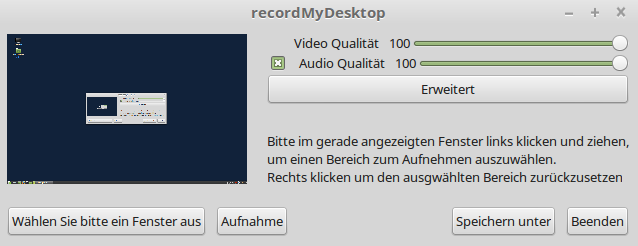
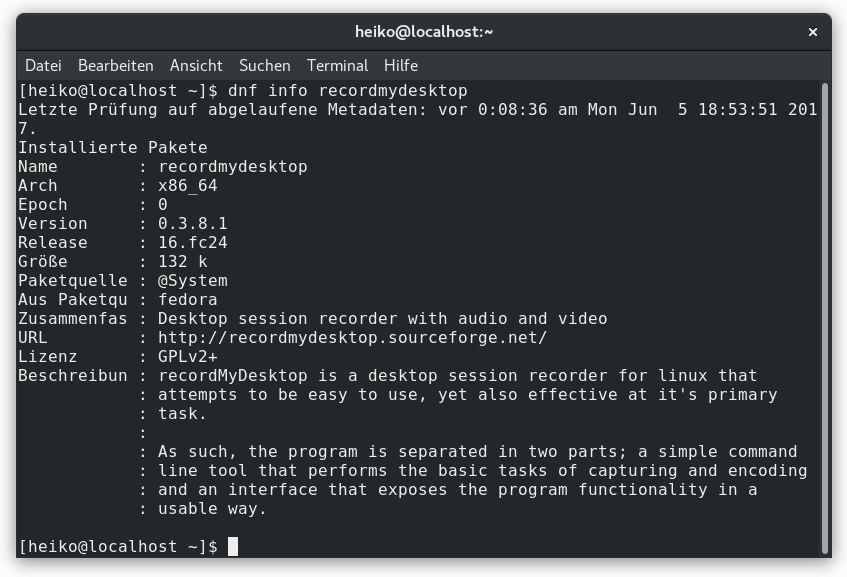

### recordMyDesktop {#recordMyDesktop}

    
***Abbildung:*** RecordMyDesktop

[RecordMyDesktop](http://recordmydesktop.sourceforge.net/about.php) ist 
neben [Istanbul](https://wiki.gnome.org/Projects/Istanbul) und
[xvidcap](http://xvidcap.sourceforge.net/) eines der ältesten Screencast-Tools unter Linux.
Es war mein erstes Programm, das mich beim Erstellen von Bildschirmaufnahmen für lange Zeit unterstützt hat.
Die letzte Version 0.3.8.1 wurde im Dezember 2008 veröffentlicht.

Was vielleicht nur manche wissen, recordmydesktop ist ein Kommandozeilentool.
Die Pakete gtk-recordMyDesktop und qt-recordMyDesktop sind die Frontends.
Die mit den Bibliotheken für grafische Benutzeroberflächen GTK+ und Qt behafteten
Programme formen den benutzerfreundlichen Zugang auf Desktop-Umgebungen für recordMyDesktop.
Das Kommandozeilentool wurde in C geschrieben
und steht unter der [GPL](https://de.wikipedia.org/wiki/GNU_General_Public_License).
Die Programmiersprache Python mit pyGtk und pyQt4 wurde für die beiden Frontends benutzt.

#### Installation {#recordMyDesktop_Installation}

recordMyDesktop gehört bei den meisten Linux-Distributionen zum Standard. Für die Installation
muss keine weitere Paketquelle hinzugefügt werden. Das Paket für das Kommandozeilentool
heißt `recordmydesktop`. Die Pakete für die Frontends heißen `gtk-recordmydesktop` und
`qt-recordmydesktop`. 

##### Installation unter Fedora {#recordMyDesktop_Installation_Fedora}

    
***Abbildung:*** RecordMyDesktop - Fedora - dnf info

Bei Fedora lauten die Befehle für Installation:

```
sudo dnf install recordmydesktop
sudo dnf install gtk-recordmydesktop
sudo dnf install qt-recordmydesktop
# für alle drei Pakete auf einmal
sudo dnf install recordmydesktop gtk-recordmydesktop qt-recordmydesktop
```

In der Gnome3-Desktopumgebung kann das Programm `Software` verwendet werden.

##### Installation unter Linux Mint und Ubuntu {#recordMyDesktop_Installation_LinuxMint}

Durch folgende Terminal-Eingaben wird recordMyDesktop der Multimedia-Sektion beigelegt:

```
sudo apt-get install recordmydesktop
sudo apt-get install gtk-recordmydesktop
sudo apt-get install qt-recordmydesktop
# für alle drei Pakete auf einmal
sudo apt-get install recordmydesktop gtk-recordmydesktop qt-recordmydesktop
```


#### Anwendung {#recordMyDesktop_Anwendung}

##### Anwendung in der Kommandozeile {#recordMyDesktop_Terminal}
