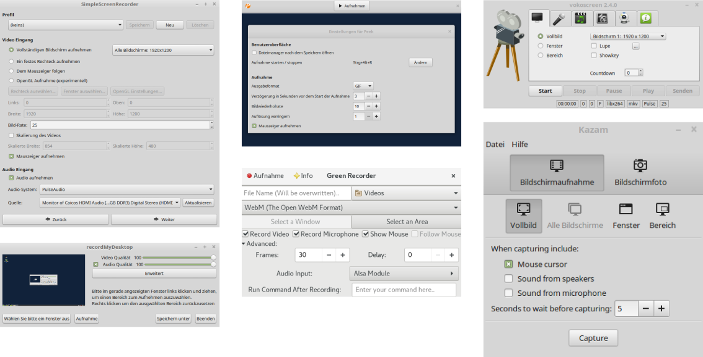

## Screencasting-Tools

 ***Abbildung:*** Screencasting-Tools: SimpleScreenRecorder, Peek, vokoscreen, recordMyDesktop, Green Recorder, Kazam (von links oben nach rechts unten) 

Konnte man 2006, als ich angefangen habe Videotutorials zu erstellen,
die Screencasting-Tools für Linux noch an einer Hand abzählen, so hat man heute eher die Qual der Wahl. 
Das Repertoire der Screencasting-Tools ist inzwischen erstaunlich vielfältig. 
Selbst heute wächst die lange Liste der Screencasting-Programme, es kommen ständig neue Tools hinzu. 
Jeder kann sich das Programm herauspicken und einsetzen, das seinen Ansprüchen genügt. 
Im [Wiki](https://wiki.ubuntuusers.de/Startseite/) von [ubuntuusers](https://ubuntuusers.de/)
findet sich eine kleine [Auswahl an Screencasting-Tools](https://wiki.ubuntuusers.de/Screencasts/) für Linux-Distributionen. 
In der englischsprachigen Wikipedia gibt es 
eine [Vergleichsliste mit Screencasting-Software](https://en.wikipedia.org/wiki/Comparison_of_screencasting_software).
Auch die spanische Wikipedia beinhaltet eine 
solche [Liste](https://es.wikipedia.org/wiki/Comparaci%C3%B3n_de_programas_de_screencast).
Im Übrigen ist eine [Liste](https://github.com/openscreencast/openscreencast_material/blob/master/tools.md),
die Werkzeuge rund um das Thema Screencasting umfasst, Bestandteil eines Git-Repositories bei mir.

Listen mit Screencasting-Tools:

* [ubuntuusers.de - Wiki - Screencasts](https://wiki.ubuntuusers.de/Screencasts/)
* [en:WP - Vergleichsliste mit Screencasting-Software](https://en.wikipedia.org/wiki/Comparison_of_screencasting_software)
* [es:WP - Vergleichsliste mit Screencasting-Software](https://es.wikipedia.org/wiki/Comparaci%C3%B3n_de_programas_de_screencast)
* [Screencasting-Tools](https://github.com/openscreencast/openscreencast_material/blob/master/tools.md)

Im [Linux-Magazin](http://www.linux-magazin.de/) wurde über die Jahre das Thema Screencasting-Tools
immer mal wieder aufgegriffen. Einige Artikel stellten diverse Screen-Recorder vor.

Zuletzt gab es einen Beitrag über Screencast-Tools im [Linux-Magazin](http://www.linux-magazin.de/) 11/2016.
In der Kategorie Software - Bitparade schrieb Erik Bärwaldt
in dem Artikel ["Und - Action!"](http://www.linux-magazin.de/Ausgaben/2016/11/Bitparade)
über Programme fürs Screencasting. Die 5 Screencasting-Tools Kazam, RecordMyDesktop,
SimpleScreenRecorder, vokoscreen und Krut wurden unter die Lupe genommen.
Sie wurden im Funktionsumfang, in der Desktop-Integration, im Bedienkonzept und in der Praxis miteinander verglichen.

Auch schon im [Linux-Magazin](http://www.linux-magazin.de/) 07/2006 schrieb
Oliver Frommel über ["Desktop-Recorder"](http://www.linux-magazin.de/Ausgaben/2006/07/Desktop-Recorder).
Damals wurden die Programme Istanbul, Byzanz, VNC2SWF, Xvidcap und Wink vorgestellt.

Zwei Jahre später verfasste Peter Kreußel im [Linux-Magazin](http://www.linux-magazin.de/) 11/2008
den Artikel ["Ordentlich in Bewegung"](http://www.linux-magazin.de/Ausgaben/2008/11/Ordentlich-in-Bewegung).
Xvidcap, Recordmydesktop, Istanbul, Byzanz, Screenkast und Wink wurden beschrieben.

Im Jahre 2010 wurde der Artikel ["Abgedreht"](http://www.linux-magazin.de/Ausgaben/2010/08/Abgedreht)
von Julia Klein im [Linux-Magazin](http://www.linux-magazin.de/) 08/2010 veröffentlicht.
Die Programme RecordMyDesktop, Record It Now, Xvidcap und VLC fanden in diesem Text Erwähnung. 

Artikel über Screencast-Tools im [Linux-Magazin](http://www.linux-magazin.de/):

| Linux-Magazin | Artikel                | Autor          | Screencast-Programme                                           |
|---------------|------------------------|----------------|----------------------------------------------------------------|
| 07/2006       | [Desktop-Recorder](http://www.linux-magazin.de/Ausgaben/2006/07/Desktop-Recorder)       | Oliver Frommel | Istanbul, Byzanz, VNC2SWF, Xvidcap, Wink                       |
| 11/2008       | [Ordentlich in Bewegung](http://www.linux-magazin.de/Ausgaben/2008/11/Ordentlich-in-Bewegung) | Peter Kreußel  | Xvidcap, Recordmydesktop, Istanbul, Byzanz, Screenkast, Wink   |
| 08/2010       | [Abgedreht](http://www.linux-magazin.de/Ausgaben/2010/08/Abgedreht)              | Julia Klein    | Record My Desktop, Record It Now, Xvidcap, VLC                 |
| 11/2016       | [Und - Action!](http://www.linux-magazin.de/Ausgaben/2016/11/Bitparade)          | Erik Bärwaldt  | Kazam, RecordMyDesktop, SimpleScreenRecorder, vokoscreen, Krut |

