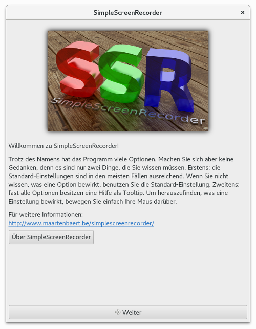
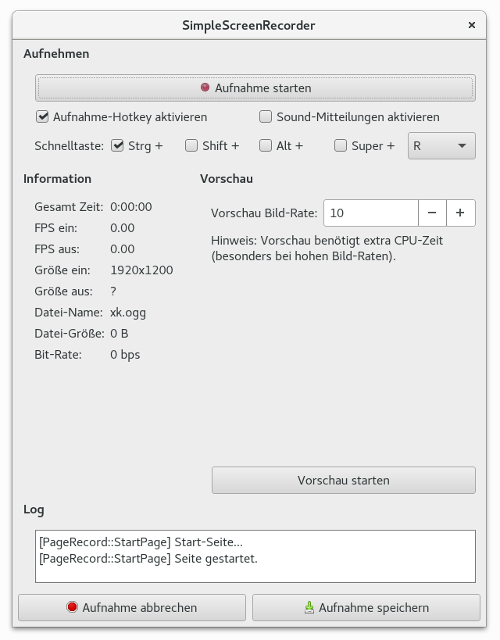

### SimpleScreenRecorder {#SimpleScreenRecorder}

    
***Abbildung:*** SimpleScreenRecorder

Der [SimpleScreenRecorder](http://www.maartenbaert.be/simplescreenrecorder/)
ist für mich seit langem das Screencast-Tool der ersten Wahl.
Es verfügt über zahlreiche Ausstattungsmerkmale. Alle üblichen
Screencast-Features sind Bestandteil vom SimpleScreenRecorder.
Stabilität und Zuverlässigkeit hat sich das Programm anscheinend
auf die Fahne geschrieben, denn seit meinem ersten Gebrauch
funktioniert der SimpleScreenRecorder tadellos.

Die Applikation wird von [Maarten Baert](https://github.com/MaartenBaert)
(und [contributors](https://github.com/MaartenBaert/ssr/graphs/contributors))
entwickelt. Die Quelldateien sind in einem [git-Repository](https://github.com/MaartenBaert/ssr)
bei dem Online-Dienst GitHub abrufbar.

#### Installation {#SimpleScreenRecorder_Installation}

Auf der Webseite vom [SimpleScreenRecorder](http://www.maartenbaert.be/simplescreenrecorder/)
stehen Installationhinweise für diverse Linux-Distributionen.
In manchen Linux-Betriebssystemen ist der SimpleScreenRecorder
in den offiziellen Repositories vorhanden und kann mit dem jeweiligen Paketmanager installiert werden.
Bei einigen anderen muss vor der Installation noch ein weiteres Repository hinzugefügt werden.

##### Installation unter Fedora {#SimpleScreenRecorder_Installation_Fedora}

Unter Fedora steckt der SimpleScreenRecorder im RPM Fusion-Repository.
Nach der Aktivierung des Software-Archivs kann das Paket für den SimpleScreenRecorder
mit einem Paketmanager oder dem Kommandozeilentool dnf installiert werden.

```
su -c "rpm -Uvh http://download1.rpmfusion.org/free/fedora/rpmfusion-free-release-stable.noarch.rpm"
su -c "dnf install simplescreenrecorder"
```

##### Installation unter Ubuntu und Linux Mint {#SimpleScreenRecorder_Installation_Ubuntu_LinuxMint}

Zuerst wird die Liste der Personal Package Archives um das SimpleScreenRecorder-PPA erweitert.
Daraufhin kann das Screencast-Tool anhand des vertrauten Prozedere installiert werden. 

```
sudo add-apt-repository ppa:maarten-baert/simplescreenrecorder
sudo apt-get update
sudo apt-get install simplescreenrecorder
```

##### Installation unter Arch Linux {#SimpleScreenRecorder_Installation_ArchLinux}

Unter Arch Linux können Sie für die Installation den
[AUR-Helper](https://wiki.archlinux.org/index.php/AUR_helpers) Ihrer Wahl nutzen.

```
pacaur -S simplescreenrecorder
```

#### Anwendung {#SimpleScreenRecorder_Anwendung}

    
***Abbildung:*** SimpleScreenRecorder - Willkommen

Der Eintrag "SimpleScreenRecorder" im Multimedia-Menü ist quasi der Startknopf für
die Applikation. "Willkommen zu SimpleScreenRecorder!" heißt es in der Begrüßung. 
Nach ein paar Anwendungstipps folgt ein Link zur Webseite von SimpleScreenRecorder
und ein Button mit der Beschriftung "Über SimpleScreenRecorder",
der zur [GNU General Public License](https://de.wikipedia.org/wiki/GNU_General_Public_License) führt.
Mit einem Klick auf den Button "Weiter" beginnt der Einstellungsdialog, der sich
aus zwei Fenstern zusammensetzt.

    
***Abbildung:*** SimpleScreenRecorder - Quellen

Im ersten Fenster des Einstellungsdialogs können Profil, Video Eingang und Audio Eingang festgelegt werden.
Als Video Eingang stehen die vier Punkte

* Vollständigen Bildschirm aufnehmen
* Ein festes Rechteck aufnehmen
* Dem Mauszeiger folgen
* OpenGL Aufnahme (experimentell)

zur Verfügung. Weiterhin kann die Bild-Rate, die Skalierung des Videos und ob der Mauszeiger
mit aufgenommen wird eingestellt werden. PulseAudio, ALSA und Jack
sind die bestimmbaren Audio-Systeme. Gleich darunter ist die Audio-Quelle wählbar.
Selbstverständlich können Sie auch festlegen, ob eine Tonspur Bestandteil der Bildschirmaufnahme ist oder nicht.
Die Einstellungen können ganz oben im Fenster durch ein Profil neu angelegt, gespeichert und gelöscht werden.
Haben Sie die Quellen für die Aufnahme erst einmal ausgewählt, 
erlangen Sie über den Button "Weiter" Zugang zum zweiten Abschnitt des Einstellungsdialogs.

    
***Abbildung:*** SimpleScreenRecorder - Datei

Während im ersten Teil eher die Frage: Was wird aufnommen ? Gegenstand der Einstellungen ist,
wird im zweiten Teil beantwortet, wo und wie die Aufnahme gespeichert wird. 
Profil, Datei, Video und Audio sind die Segmente im zweiten Einstellungsfenster.
Genauso wie im ersten Teil der Konfiguration können die Einstellungen in einem Profil gesichert werden.
Sie können sich vor dem Start der Aufnahme einen Namen für das Video überlegen und 
im Feld "Speichern als:" eintragen. Die Container Matroska (MKV), MP4, WebM, OGG und andere stehen zur Auswahl.
Des Weiteren können Video-Codec und Audio-Codec für das Video festgelegt werden.
Je nach Video- und Audio-Codec variieren die Einstellungsmöglichkeiten dazu.

    
***Abbildung:*** SimpleScreenRecorder - Aufnehmen

Nach dem Einstellungsdialog folgt das Fenster für Aufnahme. 
Das Abfilmen des Geschehens auf dem Bildschirm kann mit dem Button "Aufnahme starten" initiiert werden.
Die Tastenkombination Strg+R bewirkt ebenfalls die Screencastaktion. 
Diese Tastenkombination kann mit der Option "Aufnahme-Hotkey aktivieren" ein- und ausgeschaltet werden
und ist veränderbar. 

    
***Abbildung:*** SimpleScreenRecorder - Aufnahme

Nach dem Aufnahmestart wird die, mit dem obersten Button, verknüpfte Funktion "Aufnahme starten"
durch die Handlung "Aufnahme pausieren" ersetzt. Unten im Fenster werden die vollzogenen Schritte
in einem Log festgehalten. Folgende Informationen werden während der Aufnahme angezeigt:

* Gesamt Zeit
* FPS ein
* FPS aus
* Größe ein
* Größe aus
* Datei-Name
* Datei-Größe
* Bit-Rate

Die Aktionen "Aufnahme abbrechen" und "Aufnahme speichern" stehen unter dem Logging zur Verfügung.
Rechts neben den Aufnahme-Informationen ist eine Vorschau integriert.

    
***Abbildung:*** SimpleScreenRecorder - Linux Mint - Taskleiste - Aufnahme

    
***Abbildung:*** simplescreenrecorder --start-hidden - Fedora - Menü - Aufnahme

Ein roter Kreis in der Taskleiste weist auf die laufende Aufzeichnung der Bildschirmaktivitäten hin.
Mit einem Klick der rechten Maustaste auf das Aufnahme-Icon vom SimpleScreenRecorder
öffnet sich ein Kontextmenü, das hauptsächlich Funktionen (Pausieren, Abbrechen, Speichern) der Aufnahme berührt.
Nach dem Speichern der Aufnahme navigiert Sie ein passender Button zurück zum Start-Bildschirm.

    
***Abbildung:*** SimpleScreenRecorder - Ende

##### Anwendung in der Kommandozeile {#SimpleScreenRecorder_Terminal}

Die Anwendung kann auch mit dem Kommando `simplescreenrecorder` gestartet werden. 
Alle Optionen für die Kommandozeile listet die, für die Hilfe übliche, Ergänzung --help auf.

```
simplescreenrecorder --help
```

    
***Abbildung:*** SimpleScreenRecorder - Terminal

#### Einstellungen {#SimpleScreenRecorder_Einstellungen}

    
***Abbildung:*** SimpleScreenRecorder - Einstellungen - Dateien

Für alle Dateien des SimpleScreenRecorders wurde während der Installationsroutine ein Ordner erstellt. 
Der Ordner heißt .ssr (`~/.ssr`) und befindet sich im Home-Verzeichnis. 
In der Datei `settings.conf` können die Standard-Einstellungen für die Anwendung festgelegt werden.
Es gibt vier Bereiche:

* [global] - globale Einstellungen
* [input] - Werte für das erste Einstellungsfenster (Eingabe) der Anwendung
* [output] - Werte für das zweite Einstellungsfenster (Ausgabe) vom SimpleScreenRecorder
* [record] - Einstellungen für das Aufnahmefenster

Im Unterverzeichnis `logs` werden die Loggingdateien gespeichert.
Für die Eingabe- und Ausgabeprofile existieren die Verzeichnisse `input-profiles` und `output-profiles`.

