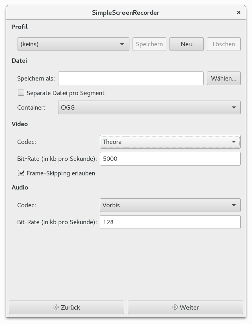
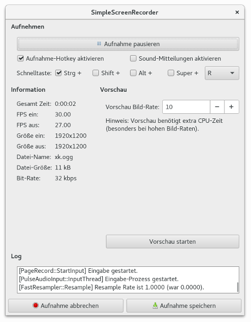
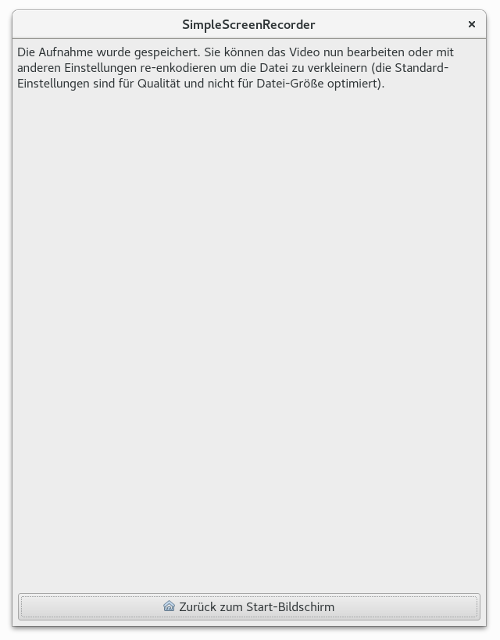

### SimpleScreenRecorder {#SimpleScreenRecorder}

    
***Abbildung:*** SimpleScreenRecorder

Der [SimpleScreenRecorder](http://www.maartenbaert.be/simplescreenrecorder/)
ist für mich seit langem das Screencast-Tool der ersten Wahl.
Es verfügt über zahlreiche Ausstattungsmerkmale. Alle üblichen
Screencast-Features sind Bestandteil vom SimpleScreenRecorder.
Stabilität und Zuverlässigkeit hat sich das Programm anscheinend
auf die Fahne geschrieben, denn seit meinem ersten Gebrauch
funktioniert der SimpleScreenRecorder tadellos.

Die Applikation wird von [Maarten Baert](https://github.com/MaartenBaert)
(und [contributors](https://github.com/MaartenBaert/ssr/graphs/contributors))
entwickelt. Die Quelldateien sind in einem [git-Repository](https://github.com/MaartenBaert/ssr)
bei dem Online-Dienst GitHub abrufbar.

#### Installation {#SimpleScreenRecorder_Installation}

Auf der Webseite vom [SimpleScreenRecorder](http://www.maartenbaert.be/simplescreenrecorder/)
stehen Installationhinweise für diverse Linux-Distributionen.
In manchen Linux-Betriebssystemen ist der SimpleScreenRecorder
in den offiziellen Repositories vorhanden und kann mit dem jeweiligen Paketmanager installiert werden.
Bei einigen anderen muss vor der Installation noch ein weiteres Repository hinzugefügt werden.

##### Installation unter Fedora {#SimpleScreenRecorder_Installation_Fedora}

```
su -c "rpm -Uvh http://download1.rpmfusion.org/free/fedora/rpmfusion-free-release-stable.noarch.rpm"
su -c "dnf install simplescreenrecorder"
```

##### Installation unter Ubuntu und Linux Mint {#SimpleScreenRecorder_Installation_Ubuntu_LinuxMint}

```
sudo add-apt-repository ppa:maarten-baert/simplescreenrecorder
sudo apt-get update
sudo apt-get install simplescreenrecorder
```

##### Installation unter Arch Linux {#SimpleScreenRecorder_Installation_ArchLinux}

Sie können den [AUR-Helper](https://wiki.archlinux.org/index.php/AUR_helpers) Ihrer Wahl nutzen.

```
pacaur -S simplescreenrecorder
```

#### Anwendung {#SimpleScreenRecorder_Anwendung}

    
***Abbildung:*** SimpleScreenRecorder - Willkommen

Der Eintrag "SimpleScreenRecorder" im Multimedia-Menü ist quasi der Startknopf für
die Applikation. Die Anwendung kann auch mit dem Kommando `simplescreenrecorder` gestartet werden.
"Willkommen zu SimpleScreenRecorder!" heißt es in der Begrüßung. 
Nach ein paar Anwendungstipps folgt ein Link zur Webseite von SimpleScreenRecorder
und ein Button mit der Beschriftung "Über SimpleScreenRecorder",
der zur [GNU General Public License](https://de.wikipedia.org/wiki/GNU_General_Public_License) führt.
Mit einem Klick auf den Button "Weiter" beginnt der Einstellungsdialog, der sich
aus zwei Fenstern zusammensetzt.

    
***Abbildung:*** SimpleScreenRecorder - Quellen

Im ersten Fenster des Einstellungsdialogs können Profil, Video Eingang und Audio Eingang festgelegt werden.

    
***Abbildung:*** SimpleScreenRecorder - Datei

    
***Abbildung:*** SimpleScreenRecorder - Aufnehmen

    
***Abbildung:*** SimpleScreenRecorder - Aufnahme

    
***Abbildung:*** SimpleScreenRecorder - Ende


