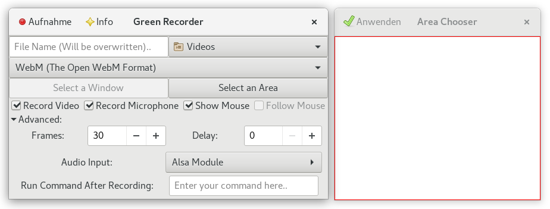

# Green Recorder

    
***Abbildung:*** Green Recorder mit Area Chooser

Wer versucht mit dem SimpleScreenRecorder oder mit recordmydesktop unter [Wayland](https://de.wikipedia.org/wiki/Wayland_(Anzeige-Server) "WP:Wayland") Screencasts aufzunehmen, 
der wird womöglich sein schwarzes Wunder erleben, denn in den Aufnahmen ist nichts weiter als ein schwarzer Bildschirm zu sehen.
Der Green Recorder ist ein weiteres Tool im großen Screencasting-Repertoire, aber eines der wenigen in der Sammlung
Screencasting unter Wayland. Was unter Wayland funtioniert ist der hauseigene Shell-Recorder von Gnome, der mit der
Tastenkombination Strg+Alt+Shift+R aktiviert und deaktiviert werden kann. 
Zur Erinnerung, die Länge der Aufnahme ist eventuell standardmäßig auf 30 Sekunden begrenzt,
kann aber mit dem dconf-editor verändert werden.
Der Green Recorder funktioniert ebenfalls unter Wayland und ist bei [github](https://github.com/green-project/green-recorder) zu finden. Die Installationshinweise für Ubuntu, Linux Mint, Fedora und Arch Linux stehen im git-Repository zur Verfügung.

## Installation

```
sudo add-apt-repository ppa:mhsabbagh/greenproject
sudo apt-get update
sudo apt-get install green-recorder
```

