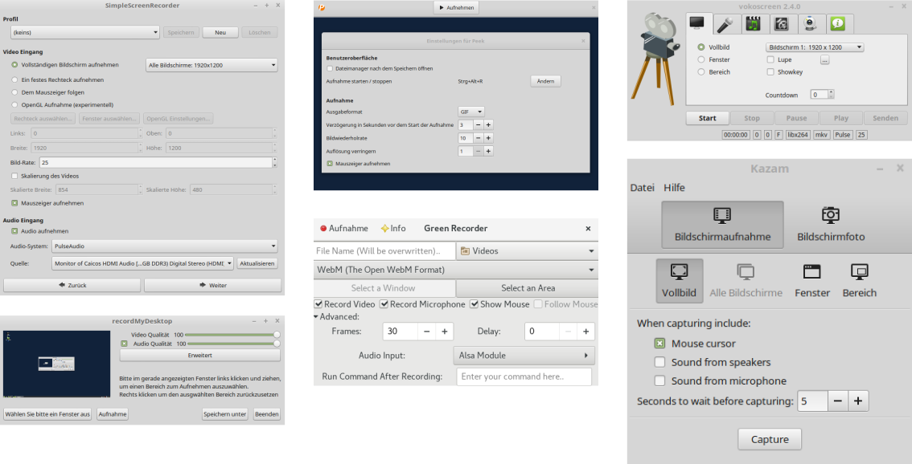

# Screencasting-Tools

 ***Abbildung:*** Screencasting-Tools: SimpleScreenRecorder, Peek, vokoscreen, recordmydesktop, Green-Recorder, Kazam (von links oben nach rechts unten) 

Konnte man 2006 die Screencasting-Tools für Linux noch an einer Hand abzählen, so hat man heute eher die Qual der Wahl. 
Das Repertoire der Screencasting-Tools ist inzwischen erstaunlich vielfältig. 
Selbst heute wächst die lange Liste der Screencasting-Programme, es kommen ständig neue Tools hinzu. 
Jeder kann sich das Programm herauspicken und einsetzen, das seinen Ansprüchen genügt. 
Im [Wiki](https://wiki.ubuntuusers.de/Startseite/) von [ubuntuusers](https://ubuntuusers.de/) findet sich eine kleine [Auswahl an Screencasting-Tools](https://wiki.ubuntuusers.de/Screencasts/) für Linux-Distributionen. 
In der englischsprachigen Wikipedia gibt es eine [Vergleichsliste mit Screencasting-Software](https://en.wikipedia.org/wiki/Comparison_of_screencasting_software).
Auch die spanische Wikipedia beinhaltet eine solche [Liste](https://es.wikipedia.org/wiki/Comparaci%C3%B3n_de_programas_de_screencast).
Im Übrigen ist eine [Liste](https://github.com/openscreencast/openscreencast_material/blob/master/tools.md),
die Werkzeuge rund um das Thema Screencasting umfasst, Bestandteil eines Git-Repositories bei mir.

Listen mit Screencasting-Tools:

* [ubuntuusers.de - Wiki - Screencasts](https://wiki.ubuntuusers.de/Screencasts/)
* [en:WP - Vergleichsliste mit Screencasting-Software](https://en.wikipedia.org/wiki/Comparison_of_screencasting_software)
* [es:WP - Vergleichsliste mit Screencasting-Software](https://es.wikipedia.org/wiki/Comparaci%C3%B3n_de_programas_de_screencast)
* [Screencasting-Tools](https://github.com/openscreencast/openscreencast_material/blob/master/tools.md)
